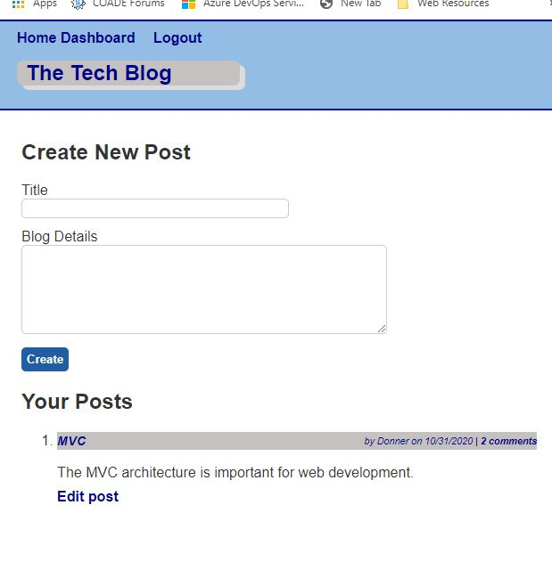

# Tech Blog Site 

Richard Ay, October 2020

## Table of Contents
* [Project Objective](#project-objective)
* [Acceptance Criteria](#acceptance-criteria)
* [Technologies Used](#technologies-used)
* [Tech Blog Logic](#tech-blog-logic)
* [Application Screen Shot](#application-screen-shot)

## Project Objective
As a developer who writes about tech, I want a CMS-style blog site so that I can publish articles, blog posts, 
and my thoughts and opinions.

## Acceptance Criteria
Given a CMS-style blog site,

1) When I visit the site for the first time, then I am presented with the homepage, which includes existing blog posts if any have been posted; navigation links for the homepage and the dashboard; and the option to log in.

2) When I click on the homepage option then I am taken to the homepage.

3) When I click on any other links in the navigation, then I am prompted to either sign up or sign in.

4) When I choose to sign up, then I am prompted to create a username and password.

5) When I click on the sign-up button, then my user credentials are saved and I am logged into the site.

6) When I revisit the site at a later time and choose to sign in then I am prompted to enter my username and password.

7) When I am signed in to the site, then I see navigation links for the homepage, the dashboard, and the option to log out.

8) When I click on the homepage option in the navigation, then I am taken to the homepage and presented with existing blog posts that include the post title and the date created.

9) When I click on an existing blog post, then I am presented with the post title, contents, post creator’s username, and date created for that post and have the option to leave a comment.

10) When I enter a comment and click on the submit button while signed in, then the comment is saved and the post is updated to display the comment, the comment creator’s username, and the date created.

11) When I click on the dashboard option in the navigation, then I am taken to the dashboard and presented with any blog posts I have already created and the option to add a new blog post.

12) When I click on the button to add a new blog post, then I am prompted to enter both a title and contents for my blog post.

13) When I click on the button to create a new blog post, then the title and contents of my post are saved and I am taken back to an updated dashboard with my new blog post.

14) When I click on one of my existing posts in the dashboard, then I am able to delete or update my post and taken back to an updated dashboard.

15) When I click on the logout option in the navigation, then I am signed out of the site.

16) When I am idle on the page for more than a set time, then I am automatically signed out of the site.

## Technologies Used
* The NPM package express.
* The NPM package express-session.
* The NPM package connect-session-sequelize.
* The NPM package express-handlebars.
* The NPM package mysql2.
* The NPM package sequelize.
* The NPM package dotenv.
* The NPM package bcrypt.

* The application is deployed on Heroku: https://macabre-village-44311.herokuapp.com/

## Tech Blog Logic
This application follows the MVC (model-view-controller) architecture. When a user logs in or signs up, a 10 minute timer is started (to monitor activity), via the session cookie.  Logging in or signing up (as a new user) takes you to the 'home' page where all the blog posts can be seen.

Once logged in, users can add blogs or add comments to blogs.  The user dashboard shows the blogs created by the (logged in) user and allows that user to edit the blog.  Blogs can also be deleted by the (logged in) owner.

## Application Screen Shot
